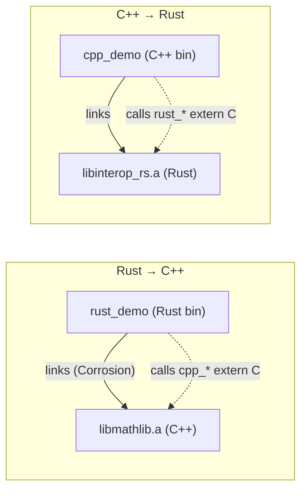

# Rust ↔ C++ Interop Demo

[](https://github.com/vladiant/rust-cpp-interop-demo/actions/workflows/ci.yml)
[](LICENSE)

A small, focused portfolio project demonstrating **bidirectional Foreign
Function Interface (FFI) interop between Rust and C++** on Linux, with real data
marshalling across the boundary in both directions.

Both directions are shown end-to-end with **two genuine executables** and a
single build/run/test command driven by **CMake + [Corrosion]**:

| Direction    | Caller (binary) | Callee library         | Symbols   | Linkage    |
|--------------|-----------------|------------------------|-----------|------------|
| Rust → C++   | `rust_demo`     | `libmathlib` (C++)     | `cpp_*`   | static lib |
| C++ → Rust   | `cpp_demo`      | `libinterop_rs` (Rust) | `rust_*`  | static lib |

The C ABI boundary (`extern "C"`) is **hand-written on both sides** — no binding
generator — so every symbol, every `#[repr(C)]` layout, and every `unsafe` site
is visible in the source.

## What crosses the boundary

Each direction passes a **primitive** and marshals at least one **struct** and
one **string**:

- **Rust → C++** (`cpp_*`): `cpp_add(i32, i32) -> i32`,
  `cpp_vec3_dot(Vec3, Vec3) -> f64`, `cpp_vec3_scale(Vec3, f64) -> Vec3`,
  `cpp_utf8_len(const char*) -> size_t`.
- **C++ → Rust** (`rust_*`): `rust_fibonacci(u32) -> u32`,
  `rust_vec3_normalize(Vec3) -> Vec3`, `rust_count_vowels(const char*) -> u32`.

Marshalling rules (see [docs/design/design.md](docs/design/design.md) §3.3):
`Vec3` is a `#[repr(C)]` / plain C++ POD passed **by value**; strings cross as
**borrowed, read-only, NUL-terminated `const char*`** (no allocation crosses the
boundary, so no cross-language `free` is needed); boundary functions are total
and never unwind across FFI. `unsafe` is confined to the FFI declaration/call
sites, each with a `// SAFETY:` comment.

## How it works

Two static libraries are built and linked in **opposite directions**, so each
language is both a caller and a callee:



- **Rust → C++:** `rust_demo` declares the C++ `cpp_*` symbols in an
  `extern "C"` block and calls them; Corrosion links the `libmathlib` static
  library into the rustc-driven binary.
- **C++ → Rust:** `cpp_demo` (and the `test_cpp_to_rust` test) include
  `rust_api.h` and link the `libinterop_rs` static library, calling the
  `#[no_mangle] extern "C"` `rust_*` symbols directly.

The C ABI is the only contract between the two sides — there is no binding
generator. `unsafe` lives **only** at the FFI boundary: the Rust `extern "C"`
declarations/definitions and the single `CStr::from_ptr` call, each annotated
with a `// SAFETY:` comment. All non-boundary logic stays in safe Rust and
ordinary C++.

## Layout

```text
cpp/                       # C++ side
  include/mathlib.h        #   Rust -> C++ callees (extern "C" decls + Vec3)
  include/rust_api.h       #   C++ -> Rust callees (extern "C" decls)
  src/mathlib.cpp          #   implements cpp_* (called from Rust)
  demo/cpp_demo.cpp        #   calls rust_* (C++ -> Rust), prints
  tests/test_cpp_to_rust.cpp  # <cassert> boundary test (FR-14)
crates/                    # Rust side
  interop_rs/src/lib.rs    #   #[no_mangle] extern "C" rust_* + #[test] units
  rust_demo/src/main.rs    #   extern "C" cpp_* block, calls + asserts (FR-13)
CMakeLists.txt             # Corrosion, targets, run_demo, CTest wiring
```

## Prerequisites

- Rust (stable, edition 2021; MSRV 1.74) with `cargo` — install via
  [rustup](https://rustup.rs/).
- A C++17 compiler: GCC (`g++` ≥ 11) or Clang (`clang++` ≥ 14).
- CMake ≥ 3.22.
- Network access on the **first** configure (CMake fetches Corrosion).

## Build

The repo ships a self-documenting `Makefile` that wraps the canonical workflow
(run `make help` to list targets). The quickest path:

```bash
make build
```

Equivalently, the underlying CMake commands:

```bash
cmake -S . -B build -DCMAKE_BUILD_TYPE=Debug
cmake --build build
```

## Run the demo (both directions)

```bash
make run
```

or directly:

```bash
cmake --build build --target run_demo
```

This runs `rust_demo` (Rust → C++) then `cpp_demo` (C++ → Rust), each printing
labeled, human-readable results.

## Run the tests

A single command runs all three tests — the two boundary tests and the pure-Rust
units:

```bash
make test
```

or directly:

```bash
ctest --test-dir build --output-on-failure
```

| Test          | Covers | Mechanism                                            |
|---------------|--------|------------------------------------------------------|
| `rust_to_cpp` | FR-13  | `rust_demo` asserts on C++ return values             |
| `cpp_to_rust` | FR-14  | `test_cpp_to_rust` asserts on Rust return values     |
| `rust_units`  | sanity | `cargo test -p interop_rs` (pure-Rust logic)         |

Run a single boundary test with `ctest --test-dir build -R rust_to_cpp` (or
`-R cpp_to_rust`).

Additional local gates mirror CI and are available as Makefile targets:
`make lint` (rustfmt + clippy + clang-format), `make asan` (scoped ASan/UBSan on
the C++-driven targets), `make valgrind` (both binaries), and `make check`
(build + test + lint).

## Documentation

- [Requirements (SRS)](docs/requirements/srs.md)
- [Design specification](docs/design/design.md)
- [Tech stack](docs/tech-stack.md)
- [QA verification report](docs/qa/verification-report.md)
- [CI/CD pipeline](docs/ci-cd/rust-cpp-interop-demo-pipeline.md)
- [Project status](docs/status.md)

## License

See [LICENSE](LICENSE).

[Corrosion]: https://github.com/corrosion-rs/corrosion
