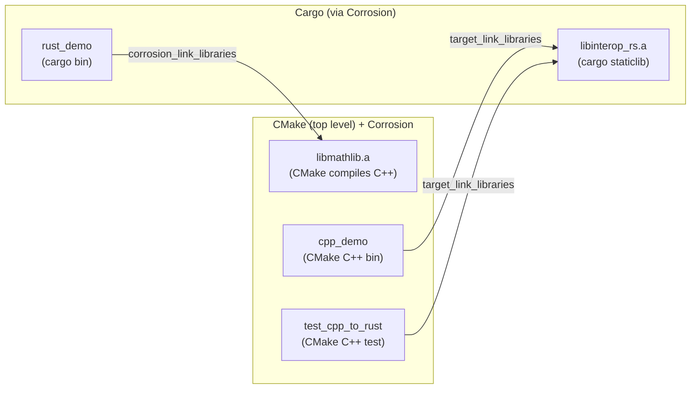

# Design Specification — Rust ↔ C++ Interop Demo

**Stage:** Design (System Architect)
**Inputs:** [docs/requirements/srs.md](../requirements/srs.md), [docs/tech-stack.md](../tech-stack.md)
**Audience:** the Developer who will implement this without making further
structural decisions.

This document specifies the architecture, the concrete file/target layout, the
exact FFI signatures crossing each boundary, the demo runner, and the test wiring
for a **bidirectional Rust ↔ C++ FFI** portfolio demo on Linux. It contains no
implementation code — only interfaces, signatures, pseudocode, and diagrams.

---

## 1. Architecture Overview

The demo comprises **two independent boundary crossings**, each demonstrated by a
real executable, plus a shared, minimal set of libraries:

- **Rust → C++**: a Rust binary (`rust_demo`) links a **C++ static library**
  (`libmathlib`) and calls its `extern "C"` functions.
- **C++ → Rust**: a C++ binary (`cpp_demo`) links a **Rust static library**
  (`libinterop_rs`) and calls its `#[no_mangle] extern "C"` functions.

Both boundaries use the **C ABI** (`extern "C"`) with **hand-written**
declarations on each side. No binding generator (e.g. `cxx`, bindgen) is used, so
every symbol and every marshalling step is visible in the source — the most
educational choice for a demo (see Design Decisions).

**Symbol boundary summary**

| Direction   | Caller (binary) | Callee library         | Symbols        | Linkage             |
|-------------|-----------------|------------------------|----------------|---------------------|
| Rust → C++  | `rust_demo`     | `libmathlib` (C++)     | `cpp_*`        | static lib          |
| C++ → Rust  | `cpp_demo`      | `libinterop_rs` (Rust) | `rust_*`       | static lib          |

Static libraries are chosen over shared libraries for reproducibility and
simplicity: no `LD_LIBRARY_PATH`, no runtime lookup, everything resolved at link
time (NFR-2).

### 1.1 Component diagram

```mermaid
graph TD
    subgraph Rust_to_Cpp["Rust → C++ direction"]
        RD["rust_demo (Rust bin)"]
        ML["libmathlib.a (C++ static lib)<br/>cpp_add / cpp_vec3_dot /<br/>cpp_vec3_scale / cpp_utf8_len"]
        RD -- "extern \"C\" calls (unsafe)" --> ML
    end

    subgraph Cpp_to_Rust["C++ → Rust direction"]
        CD["cpp_demo (C++ bin)"]
        IR["libinterop_rs.a (Rust static lib)<br/>rust_fibonacci / rust_vec3_normalize /<br/>rust_count_vowels"]
        CD -- "extern \"C\" calls" --> IR
    end

    subgraph Tests["Tests (CTest)"]
        T1["rust_to_cpp test<br/>= run rust_demo, assert"]
        T2["test_cpp_to_rust (C++ &lt;cassert&gt;)<br/>links libinterop_rs"]
    end

    T1 -.covers.-> Rust_to_Cpp
    T2 -.covers.-> Cpp_to_Rust
```

### 1.2 Build orchestration graph

CMake is the top-level driver; Corrosion imports the Cargo crates as CMake
targets. The dependency graph is an acyclic DAG (no circular linking):



Who builds what:
- **CMake** compiles the C++ sources into `libmathlib.a`, and builds the C++
  executables `cpp_demo` and `test_cpp_to_rust`.
- **Cargo** (invoked by Corrosion) builds `libinterop_rs.a` (crate-type
  `staticlib`) and the `rust_demo` binary.
- **Corrosion** wires the two link edges: `rust_demo → libmathlib` and
  (`cpp_demo`, `test_cpp_to_rust`) `→ libinterop_rs`, including Rust's std/runtime
  link requirements.

---

## 2. Module / Target / Package Layout

Concrete directory and file layout the Developer will create. Names are
prescriptive. Files marked *(Developer writes later)* are downstream artifacts.

```text
rust-cpp-interop-demo/
├── CMakeLists.txt                 # top-level: Corrosion, targets, CTest, run_demo
├── Cargo.toml                     # Rust workspace manifest (members below)
├── Cargo.lock                     # committed lockfile (NFR-2)
├── .clang-format                  # C++ style (quality checks)
├── rustfmt.toml                   # optional; rustfmt defaults are fine
├── README.md                      # FR-11 (Developer/Tech-writer stage)
├── LICENSE                        # existing
├── .gitignore                     # ignore build/ and target/
├── cmake/                         # (optional) Corrosion FetchContent glue
│
├── docs/
│   ├── requirements/srs.md
│   ├── tech-stack.md
│   └── design/design.md           # this document
│
├── cpp/                           # ── C++ SIDE ──
│   ├── include/
│   │   ├── mathlib.h              # Rust→C++ callees: extern "C" decls + Vec3 POD
│   │   └── rust_api.h            # C++→Rust callees: extern "C" decls of Rust exports
│   ├── src/
│   │   └── mathlib.cpp          # implements cpp_* functions (Rust→C++ callees)
│   ├── demo/
│   │   └── cpp_demo.cpp         # main(): calls rust_* (C++→Rust direction), prints
│   └── tests/
│       └── test_cpp_to_rust.cpp # <cassert> test of rust_* (FR-14)
│
└── crates/                        # ── RUST SIDE ──
    ├── interop_rs/               # Rust lib exported to C++ (C++→Rust callees)
    │   ├── Cargo.toml           # crate-type = ["staticlib", "rlib"]
    │   └── src/
    │       └── lib.rs           # #[no_mangle] extern "C" rust_* + #[test] units
    └── rust_demo/                # Rust bin calling C++ (Rust→C++ direction)
        ├── Cargo.toml
        └── src/
            └── main.rs          # extern "C" block for cpp_*; calls + asserts (FR-13)
```

Layout rationale (FR-12): everything under `cpp/` is C++; everything under
`crates/` is Rust. Within each, filenames name the direction and role:
`mathlib.*` = C++ code called *from* Rust; `cpp_demo.cpp` = C++ code that *calls*
Rust; `interop_rs` = Rust code called *from* C++; `rust_demo` = Rust code that
*calls* C++. A reviewer can identify each side of each boundary at a glance.

The workspace `Cargo.toml` declares `members = ["crates/interop_rs", "crates/rust_demo"]`.
`interop_rs` uses `crate-type = ["staticlib", "rlib"]` so the same code produces a
C-linkable `libinterop_rs.a` **and** remains testable with `cargo test` as an rlib.

---

## 3. Key Interfaces (FFI Contracts)

Both boundaries share one POD layout convention. On the C++ side it is a plain
struct; on the Rust side it is `#[repr(C)]`. The layouts **must** match exactly
(three contiguous `double`s, C ABI).

```text
Shared POD layout (per direction, layout-identical):
    C++:   struct Vec3 { double x; double y; double z; };
    Rust:  #[repr(C)] pub struct Vec3 { pub x: f64, pub y: f64, pub z: f64 }
```

### 3.1 Rust → C++  (callees implemented in C++, called from Rust)

C++ declarations — `cpp/include/mathlib.h` (guarded with `extern "C"` for C++):

```c
typedef struct Vec3 { double x; double y; double z; } Vec3;

int32_t cpp_add(int32_t a, int32_t b);          // FR-2: primitive in, primitive out
double  cpp_vec3_dot(Vec3 a, Vec3 b);           // FR-3: struct in,   primitive out
Vec3    cpp_vec3_scale(Vec3 v, double factor);  //       struct in,   struct out
size_t  cpp_utf8_len(const char* s);            // FR-3: string in,   primitive out
```

Rust side — declared in `crates/rust_demo/src/main.rs`:

```rust
#[repr(C)]
#[derive(Clone, Copy)]
pub struct Vec3 { pub x: f64, pub y: f64, pub z: f64 }

extern "C" {
    fn cpp_add(a: i32, b: i32) -> i32;
    fn cpp_vec3_dot(a: Vec3, b: Vec3) -> f64;
    fn cpp_vec3_scale(v: Vec3, factor: f64) -> Vec3;
    fn cpp_utf8_len(s: *const std::os::raw::c_char) -> usize;
}
// SAFETY: each call site wraps these in `unsafe { ... }`; strings pass a
// borrowed CString/CStr pointer that C++ only reads for the duration of the call.
```

### 3.2 C++ → Rust  (callees implemented in Rust, called from C++)

Rust exports — `crates/interop_rs/src/lib.rs`:

```rust
#[repr(C)]
#[derive(Clone, Copy)]
pub struct Vec3 { pub x: f64, pub y: f64, pub z: f64 }

#[no_mangle]
pub extern "C" fn rust_fibonacci(n: u32) -> u32 { /* FR-6 primitive in/out */ }

#[no_mangle]
pub extern "C" fn rust_vec3_normalize(v: Vec3) -> Vec3 { /* FR-7 struct in/out */ }

/// # Safety: `s` must be a valid, NUL-terminated C string, borrowed for the call.
#[no_mangle]
pub unsafe extern "C" fn rust_count_vowels(s: *const c_char) -> u32 { /* FR-7 */ }
```

C++ declarations — `cpp/include/rust_api.h`:

```c
typedef struct Vec3 { double x; double y; double z; } Vec3;

uint32_t rust_fibonacci(uint32_t n);          // FR-6: primitive in, primitive out
Vec3     rust_vec3_normalize(Vec3 v);         // FR-7: struct in,    struct out
uint32_t rust_count_vowels(const char* s);    // FR-7: string in,    primitive out
```

### 3.3 Marshalling, ownership & lifetime rules

These rules apply to **both** directions and are the core correctness contract
(NFR-5, NFR-6):

1. **Primitives** (`i32/int32_t`, `u32/uint32_t`, `f64/double`, `usize/size_t`)
   are passed by value; their C ABI representations are identical on both sides.
2. **POD structs (`Vec3`)** are passed and returned **by value**. They are
   trivially copyable with no heap resource, so ownership never transfers — each
   side owns its own copy. The `#[repr(C)]` attribute guarantees the Rust layout
   matches the C++ struct.
3. **Strings** cross as **borrowed, NUL-terminated `const char*`**:
   - The **caller owns** the buffer and keeps it alive for the whole call.
   - The **callee only reads** it (Rust: `CStr::from_ptr(s).to_str()`; C++:
     `std::string_view`/`std::strlen`) and must **not** store the pointer past
     the call.
   - **No allocation crosses the boundary** and **no `free` pairing is required**,
     which keeps `unsafe` minimal and eliminates cross-language ownership hazards.
4. **Panics / exceptions do not cross the boundary.** All boundary functions are
   total (no error paths for these operations). Rust boundary functions must not
   unwind into C++; C++ boundary functions are effectively `noexcept`.
5. **`unsafe` is localized** to the `extern "C"` declaration/call sites and the
   `CStr` conversion, each annotated with a `// SAFETY:` comment (NFR-5).

Every function above passes a primitive (FR-2/FR-6) and marshals at least one
non-primitive — a struct and a string — per direction (FR-3/FR-7).

---

## 4. Demo Runner & Test Wiring

### 4.1 Demo runner (FR-9, FR-10)

- **Build from clean checkout (FR-9):**
  ```bash
  cmake -S . -B build -DCMAKE_BUILD_TYPE=Debug
  cmake --build build
  ```
- **Run the demo (FR-10)** — a single CMake custom target `run_demo` runs both
  binaries in sequence and prints clearly labeled, human-readable output:
  ```bash
  cmake --build build --target run_demo
  ```
  `run_demo` executes:
  1. `./build/rust_demo`  → prints the **Rust → C++** results
     (e.g. `cpp_add(2,3)=5`, `cpp_vec3_dot(...)=...`, `cpp_utf8_len("héllo")=...`).
  2. `./build/cpp_demo`   → prints the **C++ → Rust** results
     (e.g. `rust_fibonacci(10)=55`, `rust_vec3_normalize(...)=...`,
     `rust_count_vowels("interop")=...`).

  Each binary prints a header identifying its direction so a reviewer sees both
  crossings working in one run.

### 4.2 Test wiring (FR-13, FR-14, FR-15)

All tests run through **one command** (FR-15):
```bash
ctest --test-dir build --output-on-failure
```

CTest registers three tests:

| Test name       | Kind                       | Covers        | Mechanism                                                                 |
|-----------------|----------------------------|---------------|---------------------------------------------------------------------------|
| `rust_to_cpp`   | run `rust_demo`            | FR-13         | `rust_demo` asserts on C++ return values; non-zero exit = fail            |
| `cpp_to_rust`   | run `test_cpp_to_rust`     | FR-14         | C++ `<cassert>` test links `libinterop_rs`, asserts on Rust return values |
| `rust_units`    | run `cargo test -p interop_rs` | sanity    | pure-Rust `#[test]` of `rust_*` logic (no boundary crossing)             |

Notes:
- `rust_demo` doubles as the FR-13 boundary test: its `main` performs the
  Rust → C++ calls, prints them (serving FR-10), and `assert!`s the expected
  results, exiting non-zero on mismatch. CTest interprets exit code as pass/fail.
- `test_cpp_to_rust` is a dedicated C++ executable (not the demo) so the
  C++ → Rust assertions are isolated and clearly named (FR-14).
- Pure-Rust units run via Corrosion/`add_test` calling `cargo test -p interop_rs`;
  they guard the Rust logic independently of the FFI wiring.

---

## 5. Requirements Traceability

| SRS requirement | Design element that satisfies it                                                                 |
|-----------------|--------------------------------------------------------------------------------------------------|
| FR-1            | `libmathlib` `cpp_*` functions declared `extern "C"`, called from `rust_demo`                     |
| FR-2            | `cpp_add(i32, i32) -> i32`                                                                        |
| FR-3            | `cpp_vec3_dot`/`cpp_vec3_scale` (struct) and `cpp_utf8_len` (string)                              |
| FR-4            | `rust_demo` prints and asserts the C++ return values                                             |
| FR-5            | `interop_rs` `rust_*` functions `#[no_mangle] extern "C"`, called from `cpp_demo`                 |
| FR-6            | `rust_fibonacci(u32) -> u32`                                                                      |
| FR-7            | `rust_vec3_normalize` (struct) and `rust_count_vowels` (string)                                  |
| FR-8            | `cpp_demo` prints, and `test_cpp_to_rust` asserts, the Rust return values                         |
| FR-9            | CMake configure + build commands (§4.1)                                                          |
| FR-10           | `run_demo` target runs both binaries with labeled output (§4.1)                                  |
| FR-11           | `README.md` (Developer/Tech-writer stage) — layout reserved in §2                                 |
| FR-12           | `cpp/` vs `crates/` split; direction-named files (§2)                                            |
| FR-13           | CTest `rust_to_cpp` (asserts in `rust_demo`)                                                      |
| FR-14           | CTest `cpp_to_rust` (`test_cpp_to_rust`)                                                          |
| FR-15           | Single `ctest` command (§4.2)                                                                     |
| NFR-1           | Rust stable + C++17 on GCC/Clang, static linking, Linux-only                                     |
| NFR-2           | Committed `Cargo.lock`, pinned Corrosion tag, documented-only build steps, static libs           |
| NFR-3           | Both directions covered by `rust_to_cpp` and `cpp_to_rust` CTest tests                            |
| NFR-4           | This design + tech-stack docs + planned README                                                   |
| NFR-5           | `unsafe` confined to `extern "C"` sites + `CStr` conversion, each with `// SAFETY:` (§3.3)        |
| NFR-6           | `#[repr(C)]` matching layouts, borrowed read-only strings, by-value POD (§3.3)                   |
| NFR-7           | Zero runtime deps; only Corrosion at build time; minimal function set                            |

All functional requirements map to concrete design elements. No requirement is
unaddressed, and no design element expands scope beyond the SRS.

---

## 6. Design Decisions & Trade-offs

**D-1 — Build orchestrator: CMake + Corrosion (chosen) vs Cargo `build.rs`+`cc`.**
A Cargo-centric approach (compile C++ with the `cc` crate in `build.rs`, run via
`cargo run`/`cargo test`) is simpler and single-tool, but it makes the C++ → Rust
direction awkward: there is no natural standalone C++ executable driving Rust, so
that direction becomes a C++ function linked into a Rust-launched process — less
convincingly "C++ as the caller." CMake + Corrosion yields **two genuine
executables**, one per direction, plus one build/run/test command, and showcases
real cross-language build orchestration — the more valuable portfolio signal. The
cost is one build-time dependency (Corrosion, pinned via `FetchContent`) and
requiring both `cargo` and `cmake` present; acceptable under NFR-1/NFR-2.

**D-2 — Binding approach: hand-written `extern "C"` (chosen) vs `cxx`/bindgen.**
The `cxx` crate gives ergonomic, safer bidirectional bindings, but it hides the
marshalling behind generated glue — the opposite of what a *teaching* demo wants.
Hand-written `extern "C"` on both sides keeps every symbol, every `#[repr(C)]`
layout, and every `unsafe` site visible and reviewable (directly serving NFR-4
and NFR-5). Trade-off: more manual care to keep the two-sided declarations in
sync; mitigated by the small, fixed function set and the traceability table.

**D-3 — Static vs shared libraries: static (chosen).** Static linking removes
runtime library-path configuration and makes a clean checkout build-and-run with
only the documented steps (NFR-2). Shared libs would add `LD_LIBRARY_PATH`/rpath
concerns for no demo benefit.

**D-4 — Marshalling scope: borrowed strings + by-value POD (chosen) vs
ownership-transferring returns.** Returning heap-allocated strings/objects across
FFI (with paired `*_free` functions) is a richer teaching topic but multiplies
`unsafe` and ownership hazards, conflicting with NFR-5/NFR-7. Passing strings as
borrowed read-only `const char*` and structs by value demonstrates real
marshalling (FR-3/FR-7) with zero cross-language allocation — minimal and
provably correct. A future iteration could add an ownership-transfer example.

**D-5 — Language versions: Rust stable + C++17 (chosen).** C++17 is universally
available on current Linux toolchains and provides `std::string_view`; C++20 buys
nothing this demo needs. Rust stable (edition 2021) avoids any nightly feature.
Both maximize portability/reproducibility (NFR-1/NFR-2).

**D-6 — C++ test framework: `<cassert>` + CTest (chosen) vs GoogleTest/Catch2.**
A handful of boundary assertions do not justify a test-framework dependency.
Plain `<cassert>` under CTest keeps external test deps at zero (NFR-7) while still
giving a single pass/fail command (FR-15).

---

## 7. Risks

| Risk                                                                                 | Mitigation                                                                                          |
|--------------------------------------------------------------------------------------|----------------------------------------------------------------------------------------------------|
| **Struct layout drift** — Rust `#[repr(C)]` and C++ `struct` fall out of sync         | Single documented `Vec3` layout (§3); keep both definitions minimal; unit + boundary tests catch it |
| **Rust std link requirements** when C++ links `libinterop_rs.a`                       | Corrosion supplies the needed link flags; verify `cpp_demo`/`test_cpp_to_rust` link cleanly         |
| **Panic unwinding across FFI** (UB)                                                   | Boundary functions are total/panic-free by design (§3.3); documented rule for the Developer          |
| **Non-ASCII string handling** (`cpp_utf8_len` vs char count)                          | Define semantics explicitly (byte length vs vowel count) in the function docs; assert exact values   |
| **Corrosion/toolchain version skew** on a fresh machine                               | Pin Corrosion to an exact tag; document CMake ≥ 3.22, GCC ≥ 11 / Clang ≥ 14 in tech-stack.md         |
| **`cargo test` on `rust_demo` in isolation fails to link C++**                        | Documented test path is CTest; `rust_demo` boundary test runs through CMake where the C++ lib is linked |

---

## 8. Open Questions Back to Requirements

None. All functional and non-functional requirements are satisfiable within the
stated scope with the design above. No missing requirement or scope expansion was
identified.

---

**Design is ready for the Developer agent to implement.**
